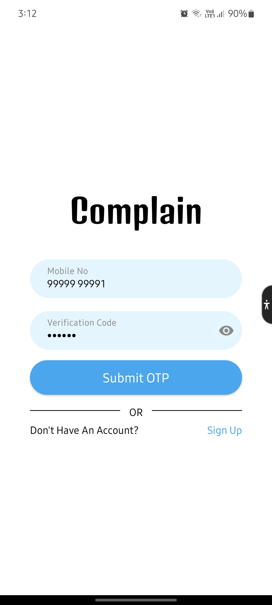
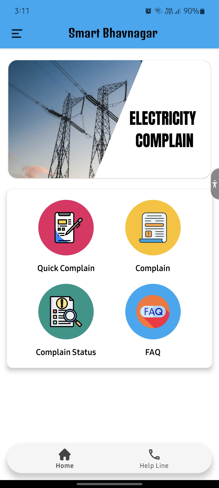
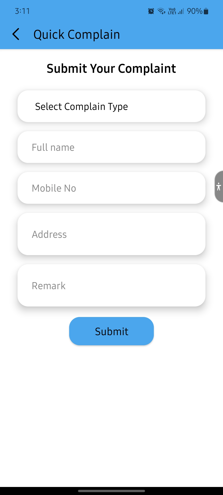
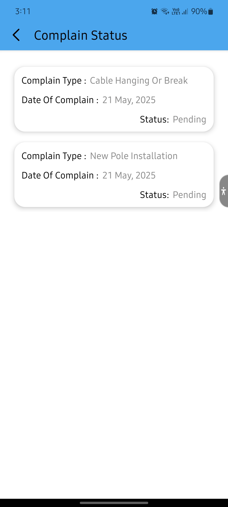
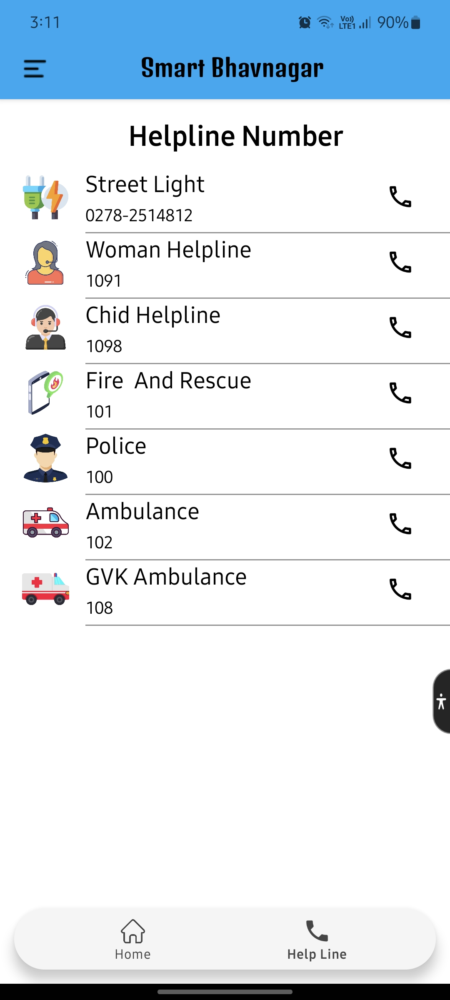

# Complain
The aim was to created an app as part of the VVP hackathon that allows users to report non functioning streetlights. It provides a form for complaints, and an electrician will come to fix the issue without the need for a phone call.

Built using Java with Firebase Realtime Database integration for handling complaint report data and Firebase Authentication for login system. 

The first version of this application has also been released - feel free to check it out.

## Mockups

   &emsp;
   &emsp;
    
   &emsp;
  

## User Credentials
MobileNumber: 99999 99991 &emsp; VerificationCode: 111111 
MobileNumber: 99999 99992 &emsp; VerificationCode: 222222 
MobileNumber: 99999 99993 &emsp; VerificationCode: 333333 
MobileNumber: 99999 99994 &emsp; VerificationCode: 444444 
MobileNumber: 99999 99995 &emsp; VerificationCode: 555555 
MobileNumber: 99999 99996 &emsp; VerificationCode: 666666 
MobileNumber: 99999 99997 &emsp; VerificationCode: 777777 
MobileNumber: 99999 99998 &emsp; VerificationCode: 888888 
MobileNumber: 99999 99999 &emsp; VerificationCode: 999999 
MobileNumber: 99999 99910 &emsp; VerificationCode: 101010

